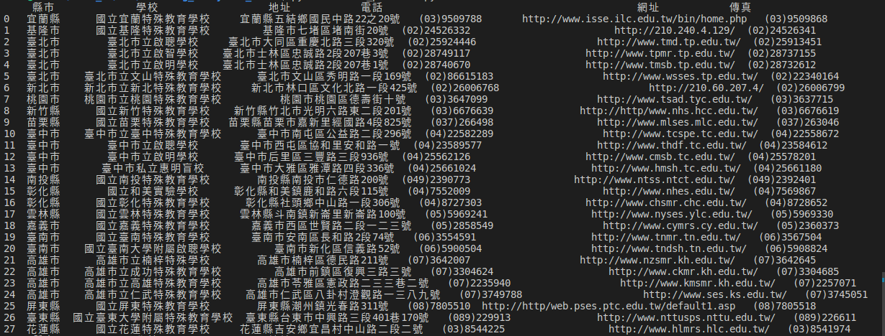
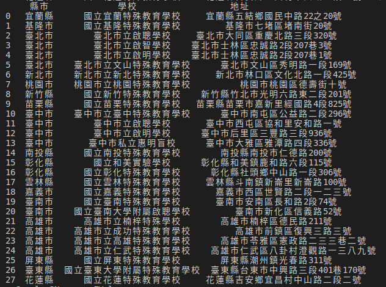
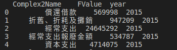
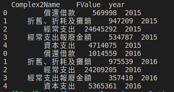

# 讀入特殊教育學校名錄

```python
data = pd.read_csv('special_edu.csv')
data.head()
print(data)
```
  

# 顯示某幾項
```python
temp1 = data[['縣市','學校', '地址']]
print(temp1)
```
  

# 讀入Firsttest檔

```python
data2 = pd.read_csv('FirstTest.csv')
temp2 = data2[['Complex2Name', 'FValue']]
Type = temp2.groupby(['Complex2Name'])['FValue'].sum().reset_index()
Type['year'] = 2015
print(Type)
```
  


# 讀入 2016 ~ 2018 年的預算資料
```python
data2016 = pd.read_csv('2016.csv')
data2017 = pd.read_csv('2017.csv')
data2018 = pd.read_csv('2018.csv')
new = data2016[['Complex2Name', 'FValue']].groupby(['Complex2Name'])['FValue'].sum().reset_index()
new['year'] = 2016

frames = [type, new]
result = pd.concat(frames)
print(result)
```
  
